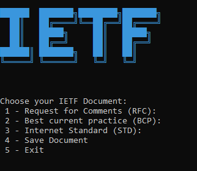

# IETF-Viewer
IETF RFC, BCP and STD Viewer

&nbsp;&nbsp;&nbsp;&nbsp;&nbsp;&nbsp;&nbsp;&nbsp;&nbsp;&nbsp;&nbsp;&nbsp;&nbsp;
&nbsp;&nbsp;&nbsp;&nbsp;&nbsp;&nbsp;&nbsp;&nbsp;&nbsp;&nbsp;&nbsp;&nbsp;&nbsp;


[](https://opensource.org/licenses/MIT)

## Features
1. Opens the chosen IETF Document in a new Google Tab
2. Save the chosen IETF Document to the User's Desktop
3. View the RFC's Title, Authors and Page count in JSON format
<br>

## Screenshot



## IETF-Viewer.exe
The python file was converted to .exe using pyinstaller

```
pyinstaller -y -F -i "ICON-PATH/book.ico"  "PYTHON-PATH/IETF_Viewer.py"
```

